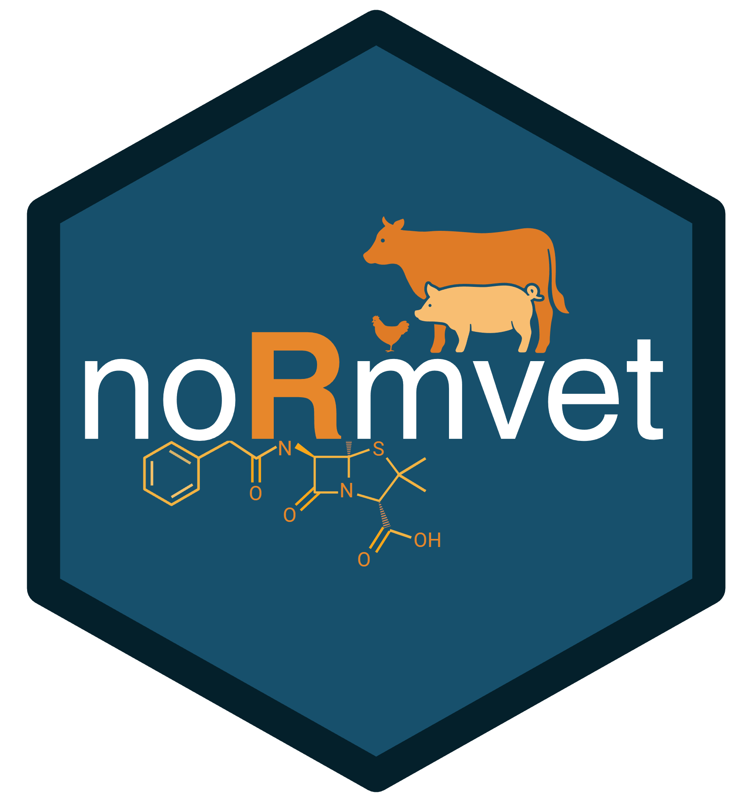

# noRmvet 

The `noRmvet` package contains functions and data frames used to analyse and 
visualize NORM-VET data from the NORM-VET database. The package also contains 
functions that are used to update the database when needed.

## Usage
The `noRmvet` package has a suite of functions for different purposes. All
functions have specific usage descriptions in R, accessible with `?`.

### Fetching data from the database
The functions `fetch_nv_data` and `fetch_nv_mic_data` are used to extract 
the main data from the database. To generate phenotypes from the mic-values,
the function `create_mic_and_phenotype` can be used.

### Datasets
Two datasets are stored within the package, namely `am_groups` and `cutoff_data`.
The `am_groups` dataset holds the antimicrobial substance names and their 
respective antimicrobial group names and codes from the internal system. The 
dataset `cutoff_data` contains all the cut-off values used for each substance and
bacterial species group. NOTE: This table holds all the cut-off values, even
older values, in contrast to the table in the NORM-VET database that only holds
the actual cut-off values relevant for the current year.

### Functions for updating the database
All functions that start with the name `update` are used to update data
in the NORM-VET database whenever this is needed. The name of these functions
are listed below. All of the update functions are structured in the same way
and are used in a similar manner. The functions provide an output that makes
it possible to compare existing data in the database to the updated data
generated by the function. Users should check this and verify the differences
before updating the database. Check the function descriptions with `?` for
detailed usage.

<pre>
- update_analyte_sens_group
- update_bacterial_category
- update_bacterial_group
- update_cutoff
- update_material_group
- update_plate_grouping
- update_report_year
- update_species_groups
</pre>
