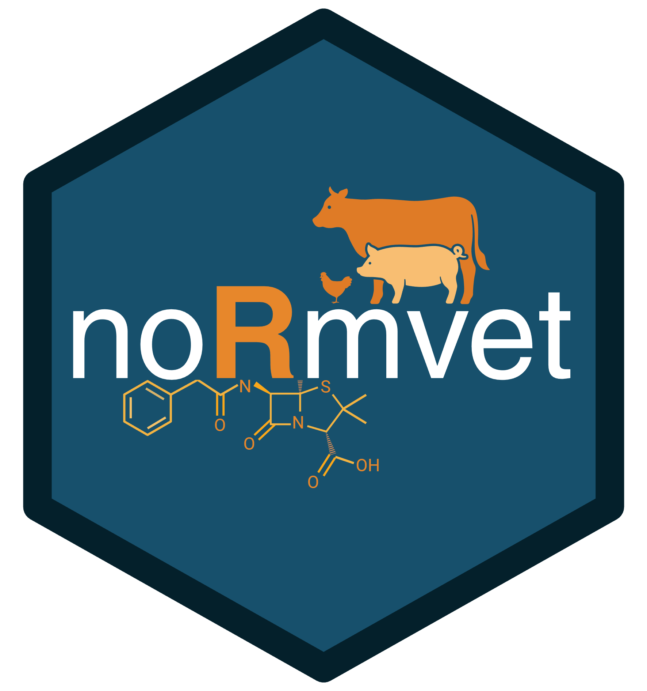

# noRmvet 

The `noRmvet` package contains functions and data frames used to analyse and 
visualize NORM-VET data from the NORM-VET database. The package also contains 
functions that are used to update the database when needed.

## Usage
The `noRmvet` package has a suite of functions for different purposes. All
functions have specific usage descriptions in R, accessible with `?`.

### Fetching data from the database
The functions `fetch_nv_data` and `fetch_nv_mic_data` are used to extract 
the main data from the database. To generate phenotypes from the mic-values,
the function `create_mic_and_phenotype` can be used. To generate gene data from
the main data, `create_gene_data` can be used.

### Datasets
Several datasets are stored within the package, namely `am_groups`, 
`panel_ranges` and `cutoff_data`, to name a few. The `am_groups` dataset holds 
the antimicrobial substance names and their respective antimicrobial group 
names and codes from the internal system. The dataset `panel_ranges` contains
information on which panels were used for each bacterium for each year, and
holds the minimum and maximum concentrations per substance in each panel. The 
dataset `cutoff_data` containsall the cut-off values used for each substance 
and bacterial species group. NOTE: This table holds all the cut-off values, 
even older values, in contrast to the table in the NORM-VET database that only 
holds the actual cut-off values relevant for the current year.

### EFSA reporting
the `noRmvet` package have several functions for generating data for EFSA 
reporting, such as `generate_efsa_data`, `generate_efsa_gene_data`, and
`generate_efsa_neg_data`. Several other functions are used to detect erroneous
or missing data, calculate synergies, and write EFSA-compatible XML files.
